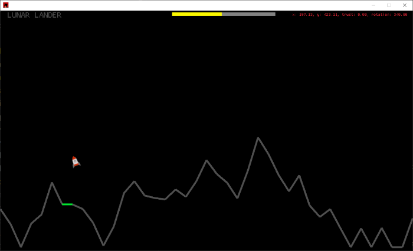

# Simple Lunar Lander clone written in rust 

## Overview

**Lunar Lander** is a classic arcade game released by Atari in 1979. The objective of the game is to safely land a lunar module on the surface of the moon.

## Gameplay

### Objective
The primary goal is to control a lunar module and land it safely on the moon's surface within a given amount of fuel.

### Controls
- **Throttle:** Controls the thrust of the lander.
- **Rotation:** Tilts the lander left or right.
- Players must balance the thrust to counteract gravity while aligning the lander for a soft landing.

### Fuel Management
- Fuel is limited and consumed by using the thrust. Efficient use of fuel is crucial for a successful landing.
- The game ends if the fuel runs out or if the lander crashes.

### Landing Zones
- The moon’s surface has only one landing zones

### Scoring
- not implemented

### UI
The ui is using [macroquad](https://docs.rs/macroquad/latest/macroquad/ui/index.html)
