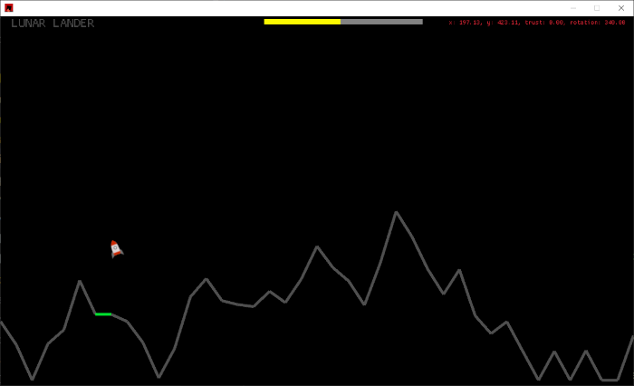

# Simple Lunar Lander clone written in rust 


## Overview

**Lunar Lander** is a classic arcade game released by Atari in 1979. The objective of the game is to safely land a lunar module on the surface of the moon.

## Gameplay


### Objective
The primary goal is to control a lunar module and land it safely on the moon's surface within a given amount of fuel.

### Controls
- **Throttle:** Controls the thrust of the lander.
- **Rotation:** Tilts the lander left or right.
- Players must balance the thrust to counteract gravity while aligning the lander for a soft landing.

### Fuel Management
- Fuel is limited and consumed by using the thrust. Efficient use of fuel is crucial for a successful landing.
- The game ends if the fuel runs out or if the lander crashes.

### Landing Zones
- The moon’s surface has only one landing zones

### Scoring
- not implemented

### UI
The ui is using [macroquad](https://docs.rs/macroquad/latest/macroquad/ui/index.html)

# Q-learning Implementation Summary

This provides a summary of the Q-learning implementation for a lunar landing simulation.

## Key Components

### Constants

- **Rewards**:
  - `REWARD_ALIVE`: Reward for being alive.
  - `REWARD_NEARER`: Reward for getting nearer to the target.
  - `REWARD_X0_Y0`: Reward for reaching the target coordinates.
  - `REWARD_CRASHED`: Penalty for crashing.
  - `REWARD_LANDED`: Reward for landing successfully.

- **Learning Parameters**:
  - `ALPHA`: Learning rate, set to 0.2.
  - `GAMMA`: Discount factor, set to 0.99.

### Function `learn`

#### Parameters

- `learning_state`: Tracks the learning process.
- `user_actions`: Represents the actions taken by the user.
- `game_state`: Represents the current state of the game.
- `lunar_module`: Represents the lunar module.
- `coordinates`: Coordinates of the surface.
- `epsilon`: Exploration rate.

#### Logic

1. **Initialization**:
   - Find the left landing zone coordinate.
   - Increment the counters in the `learning_state`.

2. **State Check**:
   - If the game state is `Landed`, update the win/lose counters.


This implementation uses Q-learning to optimize the landing strategy of a lunar module by adjusting actions based on rewards and penalties associated with different states.

### Command-Line Arguments for Lunar Landing Simulation
### `-l` or `--learn`

- **Description**: Enables Q-learning mode.
- **Usage**: 
  ```sh
  cargo run -- -l
  cargo run -- --learn
  ```
### `-e` or `--epsilon`

- **Description**: The exploration rate
- **Usage**: 
  ```sh
  cargo run -e 0.9
  cargo run --explore 0.9
  ```

  ### `-h` or `--hidegame`

- **Description**: Prevent calculation of UI (much faster)
- **Usage**: 
  ```sh
  cargo run -h 
  cargo run --hidegame
  ```
